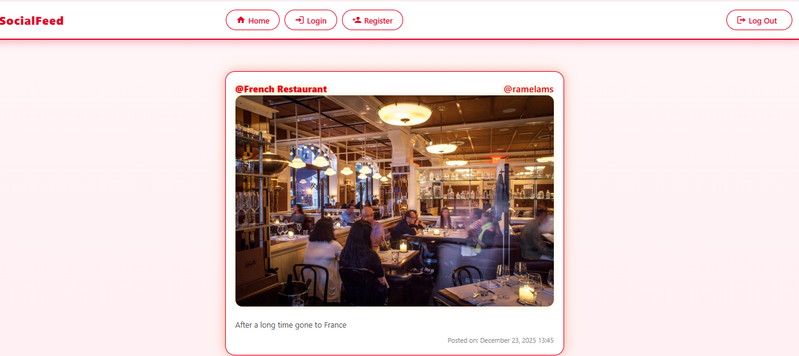
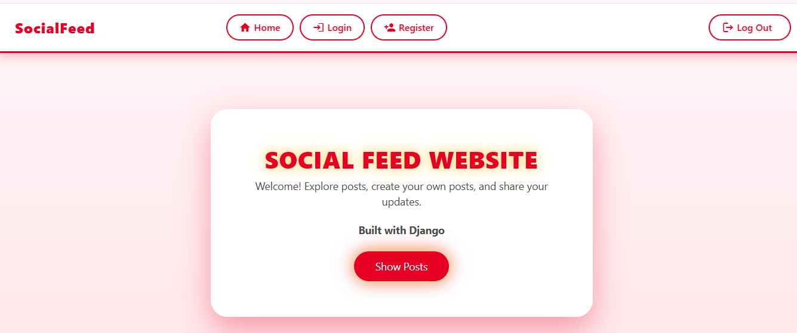
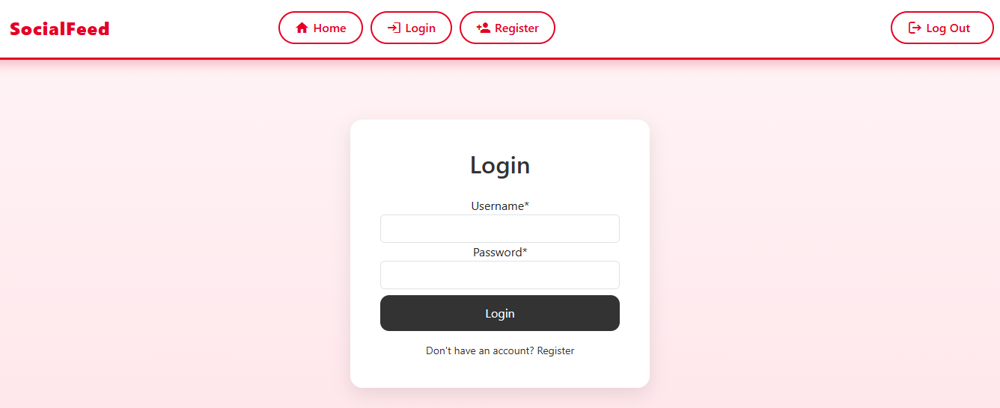
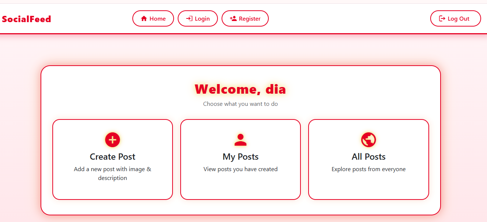
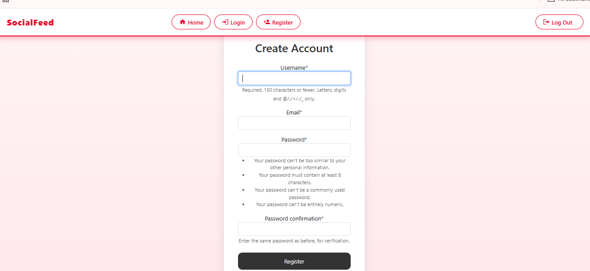

# Social Feed Website

## 📌 Project Description
A social feed platform built using **Django** that allows users to create posts, like and comment on posts, and view real-time updates. Media files are stored securely using **Cloudinary**, enabling efficient handling of images and user-generated content.

## 🎯 Impact
Enabled real-time user interaction through a cloud-backed Django social platform, allowing users to stay connected, share updates, and engage seamlessly.

## 🛠️ Tech Stack
- Python
- Django
- HTML, CSS, Bootstrap
- Cloudinary (Media Storage)
- SQLite / PostgreSQL

## 📸 Screenshots

### 📰 All Posts Page


### 🏠 Home Page


### 🔐 Login Page


### 📋 Menu Page


### 📝 Register Page



## ✨ Features
- User authentication (Register & Login)
- Create, like, and comment on posts
- Real-time feed updates
- Media upload using Cloudinary
- Responsive and user-friendly UI
- Secure data handling

## 🚀 Local Setup Instructions
```bash
git clone https://github.com/your-username/your-repo-name.git
cd your-repo-name
pip install -r requirements.txt
python manage.py migrate
python manage.py runserver
